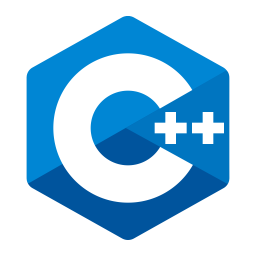
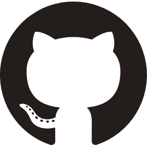
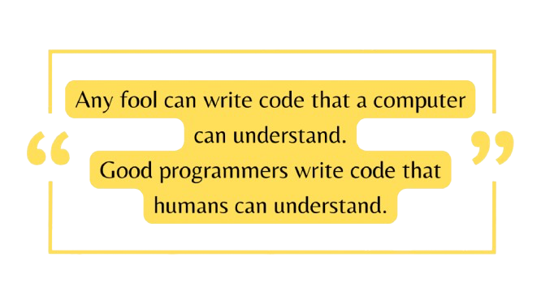

<h1 align=center>Hello World👋, I'm Rahul!</h1>

---

<h3>👨‍💻 About Me:</h3>

- 🔭 I am currently working on some computer vision projects.
- 🌱 I'm currenly learning DevOps and Competitive Programming.
- 👯 I’m looking to collaborate on any python and javascript related project
- 💬 Ask me about anything [here](https://github.com/rahul4732saini/rahul4732saini/issues/1)! I'm always happy to help.
- 📫 Reach me out here: [rahul4732saini@gmail.com](https://mail.google.com/mail/?view=cm&to=rahul4732siani@gmail.com)
- 😄 Pronouns: he/his/him
- ⚡ Fun Fact: I would tell you a joke about UDP, but you might not get it.

---

<h3 align=center>Catch me out here</h3>

---

<h3 align=center>My Report Card</h3>

 
 

---

<h3>Langauges and Tools</h3>

 

---

